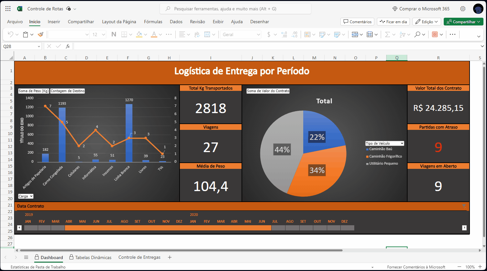

# Projetos de Análise de Dados com Excel

Este repositório contém uma coleção de projetos de análise de dados desenvolvidos utilizando Microsoft Excel para diversas aplicações e necessidades. Cada projeto utiliza tabelas dinâmicas, gráficos e outras funcionalidades do Excel para extrair insights valiosos a partir de conjuntos de dados específicos.

## Lista de Projetos

### Controle de Rotas

**Objetivo:** Facilitar o controle de entregas de uma empresa de caminhões, permitindo análises detalhadas dos dados de logística para uma gestão eficiente das operações de transporte.

**Resumo:**
Este projeto utiliza tabelas dinâmicas e gráficos no Excel para apresentar visualmente os dados de logística, permitindo análises detalhadas por período, tipo de carga e tipo de veículo. Insights incluem a otimização de rotas, ajuste de capacidades de carga e decisões informadas baseadas em dados claros e precisos.

  

- **Link para o projeto:** [Controle de Rotas](https://1drv.ms/x/s!AiFjwGBG_LP41UI6SX_aRP8mGLXX?e=iC76bP)
